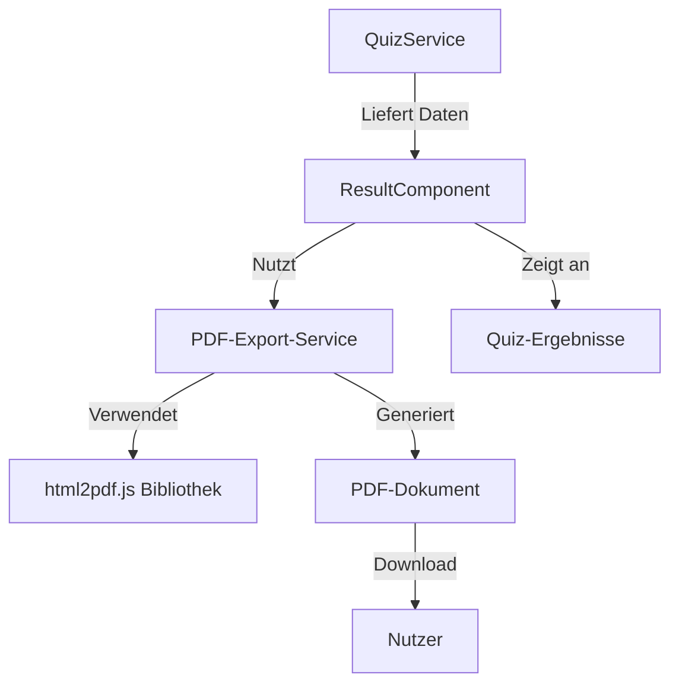

# PDF-Export für Quiz-Ergebnisse - Implementierungsplan

## Überblick

Die Implementierung des PDF-Exports für Quiz-Ergebnisse umfasst die folgenden Hauptkomponenten:

1. Eine PDF-Export-Bibliothek (html2pdf.js)
2. Einen dedizierten Service für den PDF-Export
3. Anpassungen an der ResultComponent für den Export-Button
4. Browser-Kompatibilitätsprüfungen und Fallback-Lösungen

## Architekturdiagramm



## Implementierungsschritte

### 1. Installation der html2pdf.js Bibliothek

```bash
npm install html2pdf.js --save
```

### 2. Erstellung eines PDF-Export-Services

Wir werden einen neuen Service erstellen, der die PDF-Generierungsfunktionalität kapselt:

```typescript
// src/app/pdf-export.service.ts
import { Injectable } from '@angular/core';
import html2pdf from 'html2pdf.js';

@Injectable({
  providedIn: 'root'
})
export class PdfExportService {
  constructor() {}

  /**
   * Exportiert ein HTML-Element als PDF
   * @param element Das HTML-Element, das als PDF exportiert werden soll
   * @param filename Der Name der PDF-Datei
   */
  exportToPdf(element: HTMLElement, filename: string = 'quiz-ergebnis.pdf'): void {
    const options = {
      margin: 10,
      filename: filename,
      image: { type: 'jpeg', quality: 0.98 },
      html2canvas: { scale: 2, useCORS: true },
      jsPDF: { unit: 'mm', format: 'a4', orientation: 'portrait' }
    };

    html2pdf().from(element).set(options).save();
  }
}
```

### 3. Anpassung der ResultComponent

Wir werden die ResultComponent anpassen, um einen "Als PDF exportieren"-Button hinzuzufügen und den PDF-Export-Service zu nutzen:

```typescript
// Ergänzungen für src/app/result/result.component.ts
import { PdfExportService } from '../pdf-export.service';

// Im Constructor den Service injizieren
constructor(
  private quiz: QuizService, 
  private router: Router,
  private pdfExport: PdfExportService
) {}

// Neue Methode zum Exportieren der Ergebnisse als PDF
exportAsPdf(): void {
  // Das Element mit den Quizergebnissen auswählen
  const element = document.getElementById('quiz-results');
  if (element) {
    // Einen aussagekräftigen Dateinamen erstellen
    const filename = `quiz-ergebnis-${new Date().toISOString().slice(0, 10)}.pdf`;
    this.pdfExport.exportToPdf(element, filename);
  }
}
```

Im Template der ResultComponent fügen wir einen Button hinzu und geben dem Container der Ergebnisse eine ID:

```html
<!-- Änderungen im Template der ResultComponent -->
<section>
  <h2 class="center">Ergebnis</h2>
  <p class="score center">{{ correct() }} von {{ total() }} korrekt</p>
  
  <!-- Container mit ID für PDF-Export -->
  <div id="quiz-results" class="question-evaluations">
    <!-- Bestehender Code für die Anzeige der Ergebnisse -->
    ...
  </div>
  
  <div class="actions center">
    <!-- Neuer Button für PDF-Export -->
    <button class="btn export-btn" (click)="exportAsPdf()">Als PDF exportieren</button>
    <button class="btn" (click)="again()">Nochmal spielen</button>
    <button class="btn" (click)="home()">Zur Startseite</button>
  </div>
</section>
```

Und fügen CSS-Styles für den Export-Button hinzu:

```css
/* Ergänzungen für die Styles der ResultComponent */
.export-btn {
  background-color: #4caf50;
  margin-right: 10px;
}

@media print {
  /* Styles für die Druckansicht, die auch für das PDF gelten */
  .actions {
    display: none;
  }
  
  body {
    padding: 20px;
  }
  
  .question-evaluation {
    page-break-inside: avoid;
  }
}
```

### 4. Optimierung der PDF-Darstellung

Um sicherzustellen, dass das PDF gut aussieht, können wir einige zusätzliche Styles hinzufügen, die nur für den PDF-Export gelten:

```typescript
// Ergänzung für die exportToPdf-Methode im PdfExportService
exportToPdf(element: HTMLElement, filename: string = 'quiz-ergebnis.pdf'): void {
  // Temporäre Styles für den PDF-Export hinzufügen
  const originalStyles = document.head.innerHTML;
  const pdfStyles = document.createElement('style');
  pdfStyles.innerHTML = `
    @page {
      margin: 10mm;
    }
    body {
      font-family: Arial, sans-serif;
    }
    .question-evaluation {
      margin-bottom: 15mm;
      page-break-inside: avoid;
    }
    .actions {
      display: none;
    }
  `;
  document.head.appendChild(pdfStyles);

  const options = {
    margin: 10,
    filename: filename,
    image: { type: 'jpeg', quality: 0.98 },
    html2canvas: { scale: 2, useCORS: true },
    jsPDF: { unit: 'mm', format: 'a4', orientation: 'portrait' }
  };

  // PDF generieren und dann die temporären Styles entfernen
  html2pdf().from(element).set(options).save().then(() => {
    document.head.innerHTML = originalStyles;
  });
}
```

### 5. Testen und Fehlerbehebung

Nach der Implementierung sollten wir die PDF-Export-Funktionalität gründlich testen:

1. Testen mit verschiedenen Quizergebnissen (alle richtig, alle falsch, gemischt)
2. Überprüfen der Darstellung auf verschiedenen Geräten und Browsern
3. Sicherstellen, dass alle Inhalte korrekt im PDF dargestellt werden
4. Überprüfen, dass der Download-Prozess reibungslos funktioniert

### 6. Browser-Kompatibilität

Ein wichtiger Aspekt bei der Implementierung des PDF-Exports ist die Sicherstellung der Kompatibilität mit verschiedenen Browsern. Hier sind die Maßnahmen, die wir ergreifen werden:

#### 6.1 Feature-Detection und Fallback

```typescript
// Ergänzung für den PdfExportService
export class PdfExportService {
  // ...

  /**
   * Prüft, ob der PDF-Export im aktuellen Browser unterstützt wird
   */
  isPdfExportSupported(): boolean {
    // Prüfen, ob die notwendigen Browser-Features unterstützt werden
    const hasBlob = typeof Blob !== 'undefined';
    const hasURL = typeof URL !== 'undefined' && typeof URL.createObjectURL === 'function';
    const hasAnchor = typeof document !== 'undefined' && typeof document.createElement === 'function';
    
    return hasBlob && hasURL && hasAnchor;
  }

  /**
   * Exportiert ein HTML-Element als PDF mit Fallback für nicht unterstützte Browser
   */
  exportToPdf(element: HTMLElement, filename: string = 'quiz-ergebnis.pdf'): void {
    // Prüfen, ob der PDF-Export unterstützt wird
    if (!this.isPdfExportSupported()) {
      this.handleUnsupportedBrowser(element);
      return;
    }

    // Rest der Methode bleibt unverändert
    // ...
  }

  /**
   * Fallback für Browser, die den PDF-Export nicht unterstützen
   */
  private handleUnsupportedBrowser(element: HTMLElement): void {
    // Dem Nutzer eine Nachricht anzeigen
    alert('Der PDF-Export wird in Ihrem Browser leider nicht unterstützt. ' +
          'Bitte versuchen Sie es mit einem aktuellen Chrome, Firefox, Safari oder Edge Browser.');
    
    // Optional: Druckdialog öffnen als Alternative
    if (confirm('Möchten Sie die Seite stattdessen drucken?')) {
      window.print();
    }
  }
}
```

#### 6.2 Anpassungen in der ResultComponent

```typescript
// Ergänzungen für die ResultComponent
export class ResultComponent {
  // ...

  // Flag für die Unterstützung des PDF-Exports
  pdfExportSupported = true;

  constructor(
    private quiz: QuizService,
    private router: Router,
    private pdfExport: PdfExportService
  ) {
    // Prüfen, ob der PDF-Export unterstützt wird
    this.pdfExportSupported = this.pdfExport.isPdfExportSupported();
  }

  // ...
}
```

Im Template der ResultComponent:

```html
<div class="actions center">
  <!-- PDF-Export-Button nur anzeigen, wenn unterstützt -->
  <button *ngIf="pdfExportSupported" class="btn export-btn" (click)="exportAsPdf()">
    Als PDF exportieren
  </button>
  <!-- Drucken-Button als Alternative anzeigen, wenn PDF-Export nicht unterstützt wird -->
  <button *ngIf="!pdfExportSupported" class="btn print-btn" (click)="printResults()">
    Ergebnisse drucken
  </button>
  <button class="btn" (click)="again()">Nochmal spielen</button>
  <button class="btn" (click)="home()">Zur Startseite</button>
</div>
```

#### 6.3 Browser-spezifische Anpassungen

```typescript
// Ergänzungen für den PdfExportService
private getBrowserSpecificOptions(): any {
  const options = {
    margin: 10,
    image: { type: 'jpeg', quality: 0.98 },
    html2canvas: { scale: 2, useCORS: true },
    jsPDF: { unit: 'mm', format: 'a4', orientation: 'portrait' }
  };

  // Browser-spezifische Anpassungen
  const userAgent = navigator.userAgent.toLowerCase();
  
  // Safari-spezifische Anpassungen
  if (userAgent.indexOf('safari') !== -1 && userAgent.indexOf('chrome') === -1) {
    options.html2canvas.scale = 3; // Höhere Auflösung für Safari
  }
  
  // Firefox-spezifische Anpassungen
  if (userAgent.indexOf('firefox') !== -1) {
    options.html2canvas.letterRendering = true;
  }

  return options;
}
```

#### 6.4 Testen auf verschiedenen Browsern

Wir werden die PDF-Export-Funktionalität auf folgenden Browsern testen:

1. **Chrome** (neueste Version)
2. **Firefox** (neueste Version)
3. **Safari** (neueste Version)
4. **Edge** (neueste Version)
5. **Mobile Browser** (iOS Safari, Chrome für Android)

Für jeden Browser werden wir folgende Aspekte testen:
- Korrekte Darstellung des PDFs
- Funktionalität des Export-Buttons
- Fallback-Mechanismus bei nicht unterstützten Browsern
- Performance und Ladezeiten

## Zusammenfassung

Mit diesem Ansatz können wir eine benutzerfreundliche PDF-Export-Funktionalität für die Quiz-Ergebnisse implementieren. Die Verwendung von html2pdf.js ermöglicht es uns, die bestehende HTML-Struktur direkt zu nutzen und in ein gut formatiertes PDF umzuwandeln.

Die Implementierung umfasst:
1. Einen dedizierten Service für den PDF-Export
2. Einen neuen Button in der Ergebnisansicht
3. Optimierte Styles für die PDF-Darstellung
4. Eine robuste Fehlerbehandlung
5. Browser-Kompatibilitätsprüfungen und Fallback-Lösungen
6. Umfassende Tests auf verschiedenen Browsern

Diese Lösung bietet den Nutzern die Möglichkeit, ihre Quizergebnisse zu speichern und zu teilen, was die Gesamtfunktionalität der Anwendung verbessert, und stellt sicher, dass die Funktionalität auf einer breiten Palette von Browsern und Geräten verfügbar ist.